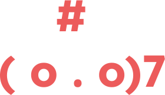

# NUS Fintechies •  [](https://github.com/0xwuchuan/BC_On_Chain_Membership/actions/workflows/test.yml)

NUS Fintechies is an on-chain membership NFT project done as part of NUS Fintech Society Blockchain Department's Winter Project AY22/23

## Directories

```ml
├─ frontend ─ "Next.js Frontend"
├─ lib ─ "Contract Dependencies"
├─ script ─ "Foundry scripts for deployment + preview"
├─ scripts ─ "Typescript tests for previewing NFTs"
├─ src ─ Contract Source Code
├─ test ─ Tests for Contracts (Hardhat and Foundry)
```

## Contracts

```ml
interfaces
├── INUSFintechieMetadata ─ "Interface for metadata contract"
├── INUSFintechieRenderer ─ "Interface for renderer contract"
├─ NUSFintechieMetadata - "Metadata contract that generates metadata for Fintechie"
├─ NUSFintechieRenderer - "Renderer contract that renders Fintechie SVG"
├─ NUSFintechies - "Main ERC721 + ERC5192 contract"
```

## Getting Started

### Dependencies

- [Foundry](https://getfoundry.sh/)

  - For windows users, it is better to use WSL so that you can update foundry easily through foundryup

- Use Foundry:

```bash
forge install
forge test
```

- Use Hardhat:

```bash
npm install
npx hardhat test
```

- Write / run tests with either Hardhat or Foundry:

```bash
forge test
# or
npx hardhat test
```

- Install libraries with Foundry which work with Hardhat.

```bash
forge install vectorized/solady # Already in this repo, just an example
```

### Previewing NFTs

- In order to preview SVGs and their respective metadata

```bash
npm run preview
```

## Notes

Whenever you install new libraries using Foundry, make sure to update your `remappings.txt` file by running `forge remappings > remappings.txt`.
